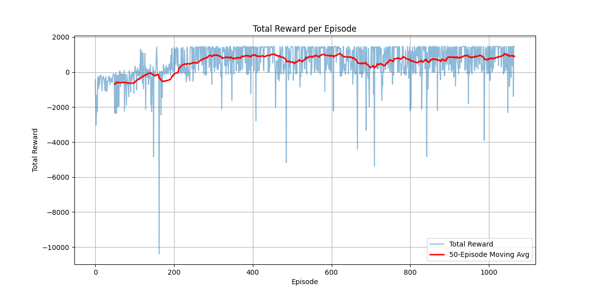

# 🏎️ DeepRL Star-Racer

A Deep Reinforcement Learning project that trains an autonomous agent to navigate a custom star-shaped race track using a **Dueling DQN** architecture.



## 🌟 Features
* **Custom Environment:** A `gymnasium` compliant environment built from scratch using Pygame.
* **Dueling DQN:** Implements a specialized neural network that splits Value and Advantage streams for better stability.
* **Lidar Sensing:** The agent uses ray-casting sensors to detect track boundaries.

## 🛠️ Installation
1. Clone the repo:
   ```bash
   git clone [https://github.com/RahulC2184/DeepRL-Star-Racer.git](https://github.com/RahulC2184/DeepRL-Star-Racer.git)


   Install dependencies:

Bash

pip install -r requirements.txt


🚀 How to Run
Train the Agent:


Bash

python main.py
View Plots:


Bash

python plot_results.py

